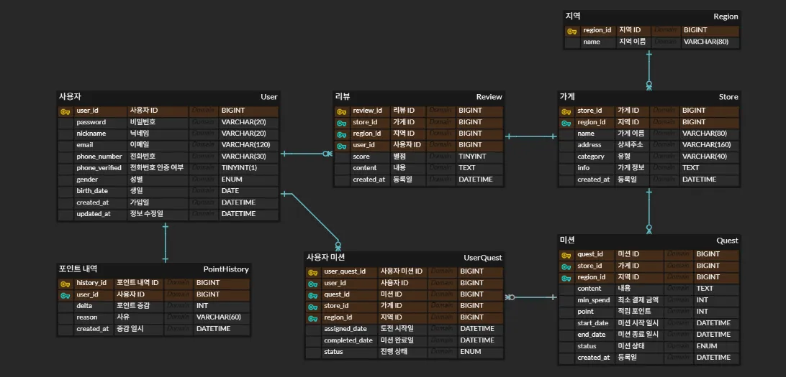

## ERD



### 1. 리뷰 작성 화면 쿼리

```sql
INSERT INTO Review
  (review_id, user_id, store_id, region_id, score, content, created_at)
VALUES
  (NULL,        -- AUTO_INCREMENT
   1,           -- 로그인한 사용자 ID
   2,           -- 선택한 가게 ID
   5,           -- 가게가 속한 지역 ID
   3,           -- 별점 (1~5)
   '굿',           -- 리뷰 내용
   NOW());
```

- NOW()는 현재 시각을 자동 입력.

### 2. 마이페이지 화면 쿼리

```sql
SELECT
    u.nickname,
    u.email,
    CASE
        WHEN u.phone_number IS NULL OR u.phone_verified = 0
             THEN '미인증'
        ELSE u.phone_number
    END AS phone_status,                    -- ← AS 별칭 필수
    COALESCE(SUM(ph.delta),0) AS point      -- 포인트 합계
FROM User u
LEFT JOIN PointHistory ph ON ph.user_id = u.user_id
WHERE u.user_id = ?
GROUP BY u.user_id, u.nickname, u.email, u.phone_number, u.phone_verified;
```

- CASE … END 결과는 반드시 AS phone_status와 같이 별칭을 주어야 가독성과 호환성이 좋음.
- COALESCE로 적립 내역이 없을 때 NULL 대신 0을 반환.

### 3. 사용자가 자신의 미션 모아서 보는 쿼리

```sql
SELECT
    uq.account_quest_id,
    q.quest_id,
    s.name         AS store_name,
    q.context      AS quest_content,
    q.point        AS reward_point,
    uq.status,
    uq.assigned_date,
    uq.completed_date
FROM UserQuest uq
JOIN Quest q  ON q.quest_id  = uq.quest_id
JOIN Store s  ON s.store_id  = q.store_id
WHERE uq.user_id = ?
  AND uq.status IN ('in_progress','completed')
ORDER BY
    CASE uq.status WHEN 'in_progress' THEN 0 WHEN 'completed' THEN 1 ELSE 2 END,
    COALESCE(uq.completed_date, uq.assigned_date) DESC
LIMIT ? OFFSET ?;
```

- LIMIT ? OFFSET ? : 페이지네이션
- 상태값을 정렬 기준으로 둬서 진행 중 → 완료 순으로 노출.

### 4. 홈 화면 쿼리

```sql
SELECT
    q.quest_id,
    s.name      AS store_name,
    q.content   AS quest_content,
    q.point     AS reward_point,
    q.end_date,
    GREATEST(0, TIMESTAMPDIFF(DAY, NOW(), q.end_date)) AS days_left,
    (SELECT COUNT(*)
       FROM Quest q2
       JOIN Store s2 ON q2.store_id = s2.store_id
      WHERE s2.region_id = :region_id
        AND q2.status = 'active'
        AND q2.start_date <= NOW()
        AND q2.end_date   >= NOW()) AS total_mission_count,
    (SELECT COUNT(*)
       FROM UserQuest uq2
       JOIN Quest q3 ON q3.quest_id = uq2.quest_id
      WHERE uq2.user_id = :user_id
        AND uq2.status  = 'completed'
        AND q3.region_id = :region_id
        AND q3.status = 'active'
        AND q3.start_date <= NOW()
        AND q3.end_date   >= NOW()) AS completed_mission_count
FROM Quest q
JOIN Store s ON q.store_id = s.store_id
LEFT JOIN UserQuest uq
       ON uq.quest_id = q.quest_id
      AND uq.user_id = :user_id
      AND uq.status = 'completed'
WHERE s.region_id = :region_id
  AND q.status = 'active'
  AND q.start_date <= NOW()
  AND q.end_date   >= NOW()
  AND uq.quest_id IS NULL
ORDER BY q.end_date ASC
LIMIT :limit OFFSET :offset;
```

**기본 조건**
- q.status = 'active' : 활성 미션만
- 기간 필터 : start_date <= NOW() AND end_date >= NOW()
- uq.quest_id IS NULL : UserQuest에 completed 상태가 존재하지 않는, 즉 아직 완료하지 않은 미션만.

**진행도 카운트**
- total_mission_count : 선택 지역에서 현재 도전 가능한 전체 미션 개수
- completed_mission_count : 사용자가 그 지역에서 이미 완료한 미션 개수
- 두 값은 행마다 동일하게 내려오므로, 프런트에서 첫 행만 읽어도 전체 진행도를 계산할 수 있음.

**days_left**
- TIMESTAMPDIFF(DAY, NOW(), q.end_date) 로 남은 일수를 계산.
- GREATEST(0, …) 로 음수가 되지 않게 방어.
